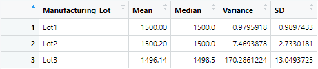

# mechacar-statistical-analysis

# Overview
The purpose of this project is to run statistical analyses on AutosRUs's prototype MechaCar, which is experiencing some production challenges. 

# Results

## Linear Regression to Predict Miles per Gallon (MPG)
A linear regression was performed to examine which of the five variables -- vehicle length, vehicle weight, spoiler angle, ground clearance, and all wheel drive (AWD) -- may have a significant impact on the MechaCar's miles per gallon (MPG) measurement.

**Equation:**

>y = -1.040e+02 = -1.040e+02 + 6.267e+00*(**vehicle_length**) + 1.245e-03*(**vehicle_weight**) + 6.877e-02*(**spoiler_angle**) + 3.546e+00*(**ground_clearance**) - 3.411e+00*(**AWD**)

**Equation Coefficients:**

|                  | Estimate   | Std.      | t value | Pr(>\|t\|) | Significance |
|------------------|------------|-----------|---------|------------|--------------|
| (Intercept)      | -1.040e+02 | 1.585e+01 | -6.559  | 5.08e-08   | ***          |
| vehicle_length   | 6.267e+00  | 6.553e-01 | 9.563   | 2.60e-12   | ***          |
| vehicle_weight   | 1.245e-03  | 6.890e-04 | 1.807   | 1.807      | .            |
| spoiler_angle    | 6.877e-02  | 6.653e-02 | 1.034   | 0.3069     |              |
| ground_clearance | 3.546e+00  | 5.412e-01 | 6.551   | 5.21e-08   | ***          |
| AWD              | -3.411e+00 | 2.535e+00 | -1.346  | 0.1852     |              |

- Multiple R-squared:  0.7149

- p-value: 5.35e-11

**Which variables/coefficients provided a non-random amount of variance to the mpg values in the dataset?**

Based on the Pr(>|t|) values of the results, the vehicle length and the ground clearance (as well as the intercept) of each vehicle is unlikely to provide a random amount of variance to the MPG values in a linear regression model. This means that vehicle length, and ground clearance both have a clear positive correlation with the MechaCar's MPG.

**Is the slope of the linear model considered to be zero? Why or why not?**

The slope of the linear model cannot be considered zero, because of the two variables that have a positive correlation with the MPG. A zero slope would indicate that there is no significant linear correlation between the MPG and each of the five variables.

**Does this linear model predict mpg of MechaCar prototypes effectively? Why or why not?**

Based on the R-squared value and the p-value of the linear model, the model appears to fit the data rather well, though it is not a perfect fit.

The R-squared value, also known as the coefficient of determination, describes the amount of variance in the response variable (y) in relation to the five predictor variables (vehicle length, vehicle weight, spoiler angle, ground clearance, and AWD). The closer to 1 the R-squared value is, the better the predictor variables are able to determine the response variable. In this case, the R-squared value is 0.7149, which means that the linear model fits the data with roughly 70% accuracy. 

The p-value shows whether or not the values of the predictor variables have any significant correlation the values of the response variable. If the p-value is 0.05 or greater, then there is insufficient evidence to conclude that the predictor variables have any significant correlation to the response variable. The p-value of the linear regression as a whole for the MechaCar is extremely small, so it is reasonable to conclude that there is a strong correlation between the predictor variables and the response variable.

## Summary Statistics on Suspension Coils
The mean, median, variance, and standard deviation of the pressure exerted on the MechaCar prototypes' suspension coils were determined from the raw data provided. Pressure was measured in units of pounds per square inch (PSI).

**Summary of All Lots**

**Summary of Individual Lots**

The design specifications of the MechaCar note that the variance of the suspension coils must not exceed 100 PSI. Although Lots 1 and 2 meet this requirement, Lot 3 greatly exceeds the limit. This means that there is a great deal of inconsistency in the prototypes from Lot 3 that is affecting the amount of pressure being placed on the suspension coils.

## T-Tests on Suspension Coils
One-sample t-tests were run on the PSI values of the MechaCar prototypes' suspension coils in order to determine whether the mean of the sample data deviates from the ideal mean, 1500 PSI. T-tests were run on all the data together, and individually on each lot.

The null hypothesis being tested is that the mean PSI is equal to the ideal mean. The results of the t-tests are as follows.

- All Lots Together
	- t = -1.8931
	- degrees of freedom (df) = 149
	- p-value = 0.06028
	- 95 percent confidence interval: 1497.507, 1500.053
	- mean of x: 1498.78

- Lot 1
	- t = 0
	- degrees of freedom (df) = 49
	- p-value = 1
	- 95 percent confidence interval: 1499.719, 1500.281
	- mean of x: 1500

- Lot 2
	- t = 0.51745
	- degrees of freedom (df) = 49
	- p-value = 0.6072
	- 95 percent confidence interval: 1499.423, 1500.977
	- mean of x: 1500.2

- Lot 3
	- t = -2.0916
	- degrees of freedom (df) = 49
	- p-value = 0.04168
	- 95 percent confidence interval: 1492.431, 1499.849
	- mean of x: 1496.14

The t-tests for lot 1, lot 2, and all the lots together all have p-values well above 0.05, which means that the null hypothesis cannot be rejected, and it wuold be reasonable to assume that their mean PSI values are equal to the ideal mean of 1500 PSI. The p-value for the t-test for lot 3, however is below 0.05, though it is still relatively close. While the null hypothesis cannot be completely rejected in this instance, when compared to the other tests, it is still a strong indication of manufacturing defects in lot 3, and should be investigated.

## Study Design: MechaCar vs Competition

# Summary

